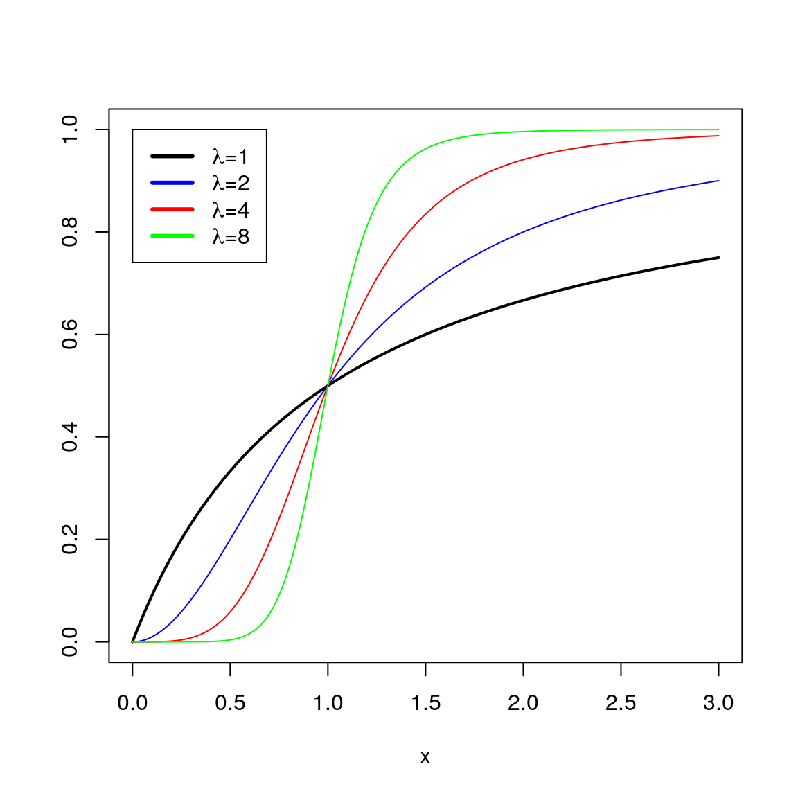

# Intro {-}

Hi, there!

In the beginning I made these notes cause I found the need to clarify some things in my head regarding the mathematical models that are used in the world of drug combinations and their synergistic effects and how these models have been used to computationally assess synergy, antagonism or non-interaction between drugs that are tested in high-throughput screens. 
So, I read a few papers (a few!) and made a Word document with notes.
Later I thought of making this as a bookdown [@R-bookdown] document since it would be much more nicier to have it in that format (even citable if need be) and surely much more accessible to the scientific community - and here we are.

**This is not a review paper in a different format than usual, just personal notes.**
I have copied statements used in the papers exactly as they were written (so full plagiarism). They wrote it, they said it, it is what it is. I repeat: these are just **NOTES**. If this doc helps you, good, if it does not, don't read it.

 
And remember, as one of my supervisors once said:

> What is a mountain, what is a synergy?

...and after a while, we concluded at:

> The mountain *is* the synergy!

# Drugs and Effects: Terminology {-}

When a drug is administered in a biological system, we expect a measured output or effect which depends on the drug’s dosage ^[In this text, *dosage* and *dose* are equivalent terms and are used to describe the quantity of the administered drug used].
Usually, when we test drugs on cell lines, the measured output is the *viability* (response) of the cells, i.e. the percentage of the cells that survived. Generally, the following definitions can be used interchangeably:

  1. *%Affected* $f_a$, drug effect $E$, *%death* or *%inhibition*. Note that this definition closely relates to the drug effectiveness itself – how effective was the drug?
  2. *%Unaffected* $f_u$, *viability*, *cell growth*, *survival*, *globaloutput* $gl$ (used in the DrugLogics pipeline ^[reference here at some point!]). Note that this definition relates to the *output on the system that the drug is used*: e.g. how much were the cells affected by the drug?

Note that the two definitions are complementary: $f_a+f_u \Rightarrow E+gl=1$.

# Dose-response curves (single drug) {-}

Drugs are administered in specific doses, so the drug’s effect is measured per each dosage. 
After the experiments are done, you end up with measurements for each drug in the form: $(x,y)$, where $x$ is the dosage and $y=E \in [E_{min},E_{max}]$  the measured effect/viability/response (depending on which definition you use). 
You can plot these points to get the *dose-response* or *dose-effect* curve. 
Usually we assume that these curves are *monotonous* (always increasing or decreasing) though that may not always be true ^[Experiments, experiments... I have seen dose-response curves that have *outliers*: so while the curve was monotonously descreasing, you have one point that creates a little step hill before ultimately going down!]. 
There exist mathematical formulas that describe them, the most prominent of which is the **4-parameter log-logistic (4PL) model** [@Yadav2015]:

\begin{equation} 
  E = \frac{E_{min}+E_{max}\left(\frac{x}{m}\right)^\lambda}{1+\left(\frac{x}{m}\right)^\lambda}
  (\#eq:4pmll)
\end{equation}

Note that $\lambda$ is the *sigmoidicity* of the curve and $m$ is the dosage of the drug that produces half the maximum effect (also defined in various texts as $EC_{50},IC_{50}$). For $E_{min}=0$, this equation is called *Hill’s equation*. 
A kind of derivative equation from \@ref(eq:4pmll) was proposed by [@Chou1984] and it’s called the **median effect equation** ^[This equation fits to the expectation of the mass-action law principle that dictates many biological processes such as cell growth or ligand-binding interactions – it’s the unified theory for the *Michaelis-Menten* equation, *Hill's* equation, *Henderson-Hasselbalch* equation and *Scatchard* equation [@Chou2006]]:

\begin{equation} 
  \frac{f_a}{f_u} = \frac{y-E_{min}}{E_{max}-y}=\left(\frac{x}{m}\right)^\lambda
  (\#eq:medeffeq)
\end{equation}

Where $f_a+f_u=1$. 
The goal when plotting this function is to find a way to measure the $m,\lambda$ parameters. 
[@Chou1984] proposed to rewrite equation \@ref(eq:medeffeq) as (generating what they called the *medial effect plot*):

\begin{equation}
  log\left(\frac{f_a}{1-f_a}\right)=\lambda\log x-\lambda\log m
  (\#eq:medeffplot)
\end{equation}

Where we can easily compute the $m,\lambda$ parameters (one is the *slope*, the other can be found where the plot cuts the $x$-axis: $y=log\left(\frac{f_a}{1-f_a}\right)=0$). 
Using \@ref(eq:4pmll) while setting $E_{max}=1,E_{min}=0$ and as $x$ the $x/m$, we can see how the sigmoidicity parameter $\lambda$ affects the shape of the curve:

(\#fig:HillsPlot)Hill's equation for different values of the slope parameter λ

Note that for $\lambda=1$ the shape is a *hyperbole*.

Also, using equation \@ref(eq:medeffeq), we can compute any dose $x$ as:

\begin{equation}
  x = m\left(\frac{f_a}{f_u}\right)^{1/\lambda} = m\left(\frac{y-E_{min}}{E_{max}-y}\right)^{1/\lambda}
  (\#eq:medeffeq)
\end{equation}
